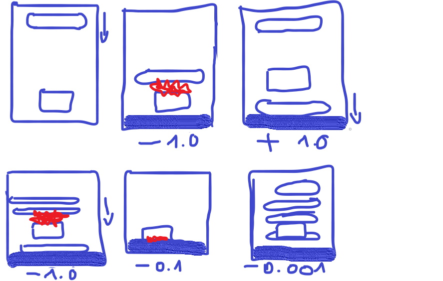

# ML-Agent Jumper

<center>
Team RedMoon

Halima Rahimi en Marnix Van de Ryck
</center>

---

## 1 Inleiding

Het project bestaat uit de onderstaande gids, die een gebruiker zou kunnen gebruiken als tutorial om de het bijbehorende project na te bootsen op zelfstandige wijze.

## 2 Installatie

- ML-Agents V1.0.5
- Python 3.8.1 of hoger
- Anaconda

## 3 De regels van het spel

Het is de bedoeling dat de character over obstakels springt. Soms kan het zijn dat er meerdere obstakels tegelijk op hem afkomt en die moet hij dan kunnen ontwijken door erover te springen. 

### 3.1 Het beloningssysteem

In figuur 4.1 kan je het beloningssysteem zien dat de character zal krijgen. Het is de bedoeling dat onze character over de obstakels springt zonder tegen één te botsen. Wanneer de character niet beweegt wordt hij niet gestraft, als hij over een obstakel springt krijgt hij een beloning, als hij tegen een obstakel botst dan wordt hij gestraft. Hij wordt ook gestraft als hij te lang in de lucht blijft en of hij de waal die boven hem bevindt raakt.



## 4 Het speelveld

Het eerste wat je kan doen is het speelveld namaken. In figuur 4.2 kan je zien welke objecten er zijn gebruikt. De speelobjecten bestaan uit: 3 cube, 1 sphere en 1 plane. Later zullen er nog objecten toegevoegd worden waar onder de 2 objecten waar je enkel de icon van kunt zien.


## 4.1 Speelveld objecten

Laten we beginnen bij het speelveld, hier komen alle objecten. Wanneer je rechtermuisklikt heb je verschillende options hier kies je voor Create Empty en die hernoem je naar environment.


Voor de road is er gebruik gemaakt van een plane met schaal X=0.4, Y=1, Z=5 de position en rotations staan op 0 en de road heeft een Mesh Collider.

## 4.2 Character speelobject

De character object heeft 2 children namelijk het oog (sphere) en het hoofd (cube). Deze twee objecten zitten in een empty object genaamd character. Je kan natuurlijk zelf een character maken maar daar kies je zelf voor, maar wij hebben het eenvoudig en simpel gehouden.


De schaal van het oog is 1 op alle richtingen en heeft Sphere Collider en de schaal van het hoofd is ook 1 op alle richtingen en heeft een Box Collider. Wanneer je deze objecten plaatst zorg dat ze voldoende boven de grond staan. Dit kan bijvoorbeeld op Y=0.5.

De volgende stap is om ervoor te zorgen dat onze character kan zien, aan de hand van een Ray Perception Sensor 3D component. Deze voeg je toe door in de inspector add component te klikken en Ray Perception Sensor 3D component te selecteren. In de volgende figuur kan je zien welke eigenschappen het oog moet hebben.


| Eigenschap | Waarde |uitleg |
|------------|--------|-------|
|Sensor Name |Eye     | De sensor heeft een unieke naam nodig|
|Detecable Tags|4: road, obstacle, wallreward, wall| Dit zijn de objecten die de character moet kunnen zien|
|Rays Per Direction | 8 | 8 stralen is genoeg om alle obstakels te kunnen zien |
|Max Ray Degrees|51|Zo kan hij de road als de wall boven hem zien|
|Sphere Cast Radius|0.22|De straal moet niet heel dik zijn|
|Ray Length|20|Lengte van de straal|
|Stacked Raycasts|1|Geheugen van de sencor|
|Start / End Vertical Offset|0 / 0.4|Naar boven of onder kijken|
---
Omdat er vier verschillende obstakel zijn is het belangrijk dat onze character die obstakels kan zien daarom hebben we er voor gekozen om de rays per direction op 8 te zetten en de max ray degrees op 51.

Wanneer je de Ray Perception Sensor 3D component voor het eerst toevoegt zal hij horizontaal zijn, maar in dit voorbeeld hebben we niet enkel obstakels voor hem maar ook boven en onder hem en om te zorgen dat hij die obstakels ziet, bewerk je de rotation van het oog (X=-23.61, Y=180, Z=79.954)

Voor de rest heeft onze character nog twee componenten: Behavior Parameters (hoe het gedrag van de agent zal zijn) en Decision Requester (de trigger die de agent laat weten dat hij een decision moet maken).


Onze character heeft een reset position nodig. Hiervoor maken we een empty object en hernoemen die naar reset, plaats het object juist boven de character zelf en geef hem een icon zodat je kan zien waar het zich bevindt.


## 4.3 De obstakels

Voor de obstakel hebben we gekozen voor een simpel sphere met schaal X=1, Y= 1,Z=1 met een Sphere Collider en een Rigidbody.

|Eigenschap|Obstakel|uitleg|
|---|---|--|
|Rigidbody component|Freeze Rotation voor de assen X en Z|We willen dat onze obstakel één richting gaat|
|Tag|obstacle|Is de tag dat de obstakel krijgt|
---


Om ervoor te zorgen dat de character weet wanneer hij over een obstakel springt voegen we een balk toe aan onze obstakel. Dubbel klik op je prefab en voeg een cube toe. Geef je cube de naam wallreward en geef hem ook de tag wallreward. Klik de Mesh Renderer zodat de wallreward niet meer zichtbaar is en geef hem een icon zo dat je wel kunt zien waar hij staat.


Omdat we de obstakel zelf niet in de scene zetten kunnen we hier best ook een empty object maken en die juist voor de start balk te plaatsen, hier worden dan de obstakels gespawnd.


## 4.3 End en start balk

De end- en start-balk zijn gelijkaardig, het is een cube met schaal x=4 , y=1 , z=1 en hebben een Box Collider en een Rigidbody. Je zet best de positie van de end block vast want we willen niet dat die van plaats verandert als een obstakel tegen hem botst. De verschillen tussen end en start staat hieronder in een lijstje. Je geeft je objecten best ook verschillende kleurtjes als contrast.


|Eigenschap|End balk|Start balk|
|---|---|---|
|Rigidbody|Use Gravity aan en Freeze Rotation en Freeze Position voor de assen X, Y en Z|Geen rigidbody component|
|tag|end|start|
---

### 4.4 Scoreboard

Voor de scorebord maken we een TextMeshPro, dit kan je doen door op GameObject te klikken, naar 3D Object te gaan en vervolgens Text - TextMeshPro te kiezen. Geef dit object de naam ScoreBoard en plaats hem zodanig dat de scoreboard zichtbaar is vanuit het perspectief van de main camera.


### 4.5 Wall

Voor we aan de scripts beginnen moet er nog één ding gebeuren, het plaatsen van de wall. Maak van een cube een rechthoek met schaal  X=4, T=0.1, Z=5 en met een Box Collider, en gedeactiveerde mesh renderer. De wall zorgt ervoor dat onze character niet hooger dan de wall kan springen, en je zet deze wall dus boven de character.


## 5 Scripts

### 5.1 Environment

Maak een script aan met de naam Environments.cs, het enige dat we in deze script zetten is het weergeven van de scorebord. Dit doen we door de methode ```GetCumulativeReward()``` op te roepen.

```cs (Environment.cs)
public class Environment : MonoBehaviour
{
    private TextMeshPro scoreBoard;
    private Character character;

    public void OnEnable()
    {
        character = transform.GetComponentInChildren<Character>();
        scoreBoard = transform.GetComponentInChildren<TextMeshPro>();
    }
    private void FixedUpdate()
    {
        scoreBoard.text = character.GetCumulativeReward().ToString("f2");
    }
}
```

### 5.2 Obstacle

Maak een script aan met de naam Obstacle.cs en voeg deze script toe aan de object obstakel.

```cs (Obstacle).cs)
public class Obstacle : MonoBehaviour
{
    private float speed;
    private bool hit = false;
    private void Update()
    {
        Move();
    }
    private void Move()
    {
        //De speed van de obstakes wordt radom bepaald
        speed = Random.Range(1f, 15f);
        transform.position += speed * transform.forward * Time.deltaTime;
    }
    private void OnCollisionEnter(Collision collision)
    {
        if(collision.collider.tag == "end")
        {
            hit = true;
            Destroy(gameObject);
        }
    }
}
```

### 5.3 WaveSpawner

Maak een script aan met de naam WaveSpawner.cs en voeg deze script toe aan obstakel. Deze script zorgt ervoor dat de obstakels op een random tijdstip gespawnd worden.

```cs (WaveSpawner.cs)
public class WaveSpawner : MonoBehaviour
{
    public Transform obstaclePrefab;
    public Transform spawnPoint;
    public float timeBetweenWaves = 5f;

    private float countdown = 2f;
    private int waveNumber = 0;
    private float waitSec = 0.5f;

    private void Update()
    {
        if(countdown <= 0f)
        {
            StartCoroutine(SpawnWave());
            countdown = timeBetweenWaves;
        }
        //Na elke sec gaat er -1 van af
        countdown  -= Time.deltaTime;
    }
    //De Ienumerator pauzeert elke 0.5sec en roept de SpwanWave opnieuw op
    IEnumerator SpawnWave()
    {
        waveNumber++;
        for (int i = 0; i < waveNumber; i++)
        {
            spawnObstacle();
            yield return new WaitForSeconds(waitSec);
        }
        if(waveNumber >= 4)
        {
            waveNumber = 0;
        }
    }
    //Aanmaken van obstacle
    void spawnObstacle()
    {
        Instantiate(obstaclePrefab, spawnPoint.position, spawnPoint.rotation);
    }
}
```

### 5.4 Character

Onze klasse ```Character.cs``` erft over van ```Agent```. Er zijn zes belangrijke methodes die we gaan gebruiken:

- ```Initialize()``` : Eenmalige initialisatie van de agent.
- ```OnEpisodeBegin()```: wat er moet gebeuren bij elke episode.
- ```OnActionReceived(float[] vectorAction)```: wat er moet gebeuren bij elke action die uitgevoerd wordt.
- ```Heuristic(float[] actionsOut)``` : wat er gedaan wordt bij elke action.
- ```OnCollisionEnter(Collision collision)```: De actions die uitgevoerd worden en de beloningen die per actie gegeven worden.
- ```OnTriggerEnter(Collider other)```: Wanneer object de collider van een ander object raakt.

```cs (Character.cs)
public class Character : Agent
{
    public float force = 15f;
    public Transform posison = null;
    private Rigidbody rigidbody = null;

    public override void Initialize()
    {
        rigidbody = this.GetComponent<Rigidbody>();
    }
    public override void OnEpisodeBegin()
    {
        ResetCharacter();
    }
    public override void OnActionReceived(float[] vectorAction)
    {
        if(vectorAction[0] == 1)
        {
            Thrust();
        }
    }
    //Er wordt -0.001 afgetrokken wanneer de character te lang in de lucht blijft
    public override void Heuristic(float[] actionsOut)
    {
        actionsOut[0] = 0;
        if(Input.GetKey(KeyCode.UpArrow) == true)
        {
            actionsOut[0] = 1;
            AddReward(-0.001f);
        }
    }
    //Rewaard
    private void OnCollisionEnter(Collision collision)
    {
        if (collision.collider.tag == "obstacle")
        {
            AddReward(-1.0f);
            Destroy(collision.gameObject);
            EndEpisode();
        }else if(collision.collider.tag == "wall")
        {
            AddReward(-0.1f);
        }
    }
    private void OnTriggerEnter(Collider other)
    {
        if(other.tag == "wallreward")
        {
            AddReward(0.5f);
        }
    }
    //De posison van character terug zetten
    private void ResetCharacter()
    {
        this.transform.position = new Vector3(posison.position.x, posison.position.y, posison.position.z);
    }
    //De character laten springen
    private void Thrust()
    {
        rigidbody.AddForce(Vector3.up * force, ForceMode.Acceleration);
    }
}
```

## 6 testen

Je kan nu zelf beginnen testen door de character met de pijltjestoets te laten springen. Voor je dit doet moet je in de Behavior type op Heuristic of Default zetten. Nu kan je de character laten springen. In de test phase is het de bedoeling dat je de spellogica gaat testen en zien of de character wel de juiste beloning krijgt. Wanneer je 100% zeker bent dat het manueel testen geslaagd is kan je verder naar de training.

## 7 training van het NN

### 7.1 configuratie van het NN

Voor we de ML-Agent kunnen laten trainen moeten we nog een paar andere zaken in orde brengen. In de folder van je project maak je een map met de naam Learning, daarin maak je een bestand aan met de naam ```Character-01.yml``` (let wel op dat de naam “Character” hetzelfde moet zijn als je Behavior Name). Open het bestand en plak dit er in. Deze file zal aan de hand van parameters beslissen hoe de training van het Neural Network juist verloopt.

```(character-01.yml)
behaviors:
  Character:
    trainer_type: ppo
    max_steps: 5.0e5
    time_horizon: 64
    summary_freq: 10000
    keep_checkpoints: 1
    checkpoint_interval: 50000
    
    hyperparameters:
      batch_size: 64
      buffer_size: 9600
      learning_rate: 3.0e-4
      learning_rate_schedule: constant
      beta: 5.0e-3
      epsilon: 0.2
      lambd: 0.95
      num_epoch: 3
      
    network_settings:
      num_layers: 2
      hidden_units: 128
      normalize: false

    reward_signals:
      extrinsic:
        strength: 1.0
        gamma: 0.99
      curiosity:
        strength: 0.02
        gamma: 0.99
        encoding_size: 256
        learning_rate : 1e-3
```

### 7.2 start de training

Nu kunnen we beginnen met de echte training. Als bepaalde parameters in de Behavior Parameters hebt aangepast zet je die terug juist zoals in het vb.


Zet je project op in unity en open je cmd, navigeer hier naar de sub-folder Learning. Vervolgens voer je de volgende code uit in de cmd “```mlagents-learn Obelix-01.yml --run-id Character-01```”. Vervolgens moet je de logo van unity te zien krijgen, zodra je de logo ziet komt op het scherm dat je mag starten. Dan ga je terug naar je unity project en klik je op start.
Wanneer je ziet dat de ML-agent genoeg heeft getraind kan je die stoppen naar de tensorboard gaan om te kijken hoe de training is verlopen. Dit doe je door in de cmd “```tensorboard --logdir results```” uit te voeren.

## 8 testen van een NN

Na het uitvoeren van het bovenstaande commando, ga je naar “```http://localhost:6006```”, om meerdere dashboards te kunnen verkennen op basis van de getrainde neural network. De voornaamste grafiek is de weergave van de belonings-evolutie, die duidelijk laat zien hoe effectief de agent heeft leren werken binnen de gestelde parameters.

Je kan op Tensorboard vele verschillende grafieken vinden, gebaseerd op welke parameters je gebruikt. Enkele goede voorbeelden kan je hieronder terugvinden.

Cumulative Reward : Deze grafiek toont de evolutie van de agent naarmate het meer getraind is. Hoe hoger de grafiek, hoe groter de bereikte reward op het einde van een episode.


Episode Length: Deze grafiek toont de evolutie van de lengtes van de episodes. Hoe hoger de grafiek, hoe langer de episodes duren en dus de agent kan "overleven" binnen de game-environment.

